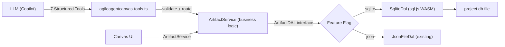
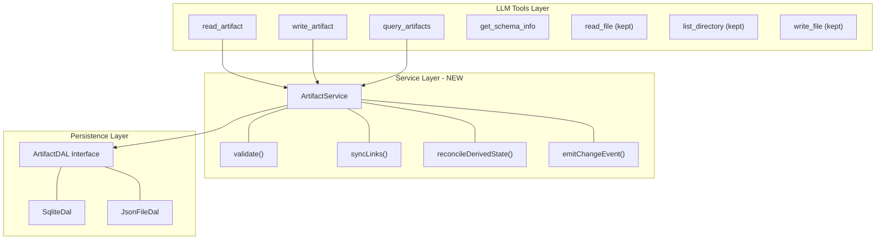

# Implementation Plan v2: SQLite DB + LLM Tool Layer

> All 3 CRITICAL + 5 HIGH audit findings fixed. See [architecture-audit.md](./architecture-audit.md) for original findings.

---

## Architecture Overview



### What Changed from v1

| Audit Finding | v1 (Broken) | v2 (Fixed) |
|---|---|---|
| **C-1** | `better-sqlite3` (native C++) | **`sql.js`** (WASM, Electron-safe) |
| **C-2** | ~50 child DDLs as comments | **Programmatic DDL generator** from JSON schemas |
| **C-3** | Polymorphic `parent_type + parent_id` | **Nullable typed FKs** (e.g., `epic_id`, `prd_id`) |
| **H-1** | No migration strategy | **Versioned migration scripts** + `schema_versions` table |
| **H-2** | DAL returns `any` | **Typed generics** with `ArtifactTypeMap` |
| **H-3** | LLM filter → raw SQL column | **Column whitelist** per artifact type |
| **H-4** | Business logic in DAL | **`ArtifactService`** layer extracted |
| **H-5** | No transactions | **`transaction()` method** on DAL |
| **M-1** | PostgreSQL syntax | **SQLite syntax** (no TEXT[], SERIAL, TIMESTAMPTZ) |
| **M-2** | Default journal | **WAL mode** at init |

---

## 1. SQLite Engine: `sql.js` (WASM)

> [!IMPORTANT]
> `better-sqlite3` uses native C++ bindings that are **incompatible with VS Code's Electron runtime**. `sql.js` compiles SQLite to WebAssembly — zero native dependencies, works in any JS environment.

### Key Differences from `better-sqlite3`

```typescript
// sql.js usage pattern:
import initSqlJs, { Database } from 'sql.js';

// Initialize WASM (once per extension activation)
const SQL = await initSqlJs();

// Load existing DB from file or create new
const fileBuffer = await vscode.workspace.fs.readFile(dbUri);
const db = new SQL.Database(fileBuffer);

// Queries are synchronous (same as better-sqlite3)
const rows = db.exec('SELECT * FROM epics WHERE status = ?', ['in-progress']);

// MUST manually persist to disk after writes
const data = db.export();  // Uint8Array
await vscode.workspace.fs.writeFile(dbUri, data);
```

**Trade-offs:**
- ✅ Works in Electron, Node.js, browser — zero ABI issues
- ✅ Synchronous query API
- ⚠️ Must manually save DB buffer to disk (auto-save on timer + on artifact write)
- ⚠️ ~2-3x slower than native — irrelevant for project-scale data (<10MB)

---

## 2. Programmatic DDL Generation (Fixes C-2)

> [!IMPORTANT]
> Instead of hand-writing ~115 CREATE TABLE statements (error-prone, incomplete), a **generator script** reads all 40 JSON schemas and produces SQLite-compatible DDL.

### New File: `src/state/schema-to-ddl.ts`

**Algorithm:**
```
for each schema file:
  1. parse JSON schema
  2. extract content.properties (skip metadata — handled by shared table)
  3. for each property:
     - scalar (string/number/boolean) → column on parent table
     - string enum → column + CHECK constraint
     - string array → TEXT column (JSON-encoded, queried via json_each())
     - object with 2-3 scalar fields → flattened columns with prefix
     - object with 4+ fields or nested objects → separate child table + FK
     - array of objects → child table with FK + sort_order
     - array of objects containing arrays → grandchild table
  4. emit CREATE TABLE with SQLite types:
     - string → TEXT
     - integer → INTEGER
     - number → REAL
     - boolean → INTEGER (0/1)
     - array → TEXT (JSON)
     - timestamps → TEXT (ISO 8601)
  5. emit CREATE INDEX for FK columns and common query patterns
```

**Output:** `src/state/db-schema.sql` — a single file with all ~115 CREATE TABLE + CREATE INDEX statements, generated and verified against schemas.

**Verification:** Post-generation, a coverage script diffs schema fields vs. table columns to catch any gaps.

---

## 3. Referential Integrity Fix (C-3)

### Nullable Typed FKs Replace Polymorphic Pattern

**Before (broken):**
```sql
-- No FK enforcement possible
CREATE TABLE findings (
    parent_type TEXT,  -- 'code-review', 'readiness', etc.
    parent_id TEXT     -- points to... something
);
```

**After (enforced):**
```sql
CREATE TABLE findings (
    id TEXT PRIMARY KEY,
    project_id TEXT NOT NULL REFERENCES projects(id),
    -- Exactly ONE of these is non-NULL:
    code_review_id TEXT REFERENCES code_reviews(id) ON DELETE CASCADE,
    readiness_report_id TEXT REFERENCES readiness_reports(id) ON DELETE CASCADE,
    research_report_id TEXT REFERENCES research_reports(id) ON DELETE CASCADE,
    test_review_id TEXT REFERENCES test_reviews(id) ON DELETE CASCADE,
    -- Enforce exactly-one:
    CHECK (
        (code_review_id IS NOT NULL) +
        (readiness_report_id IS NOT NULL) +
        (research_report_id IS NOT NULL) +
        (test_review_id IS NOT NULL) = 1
    ),
    finding TEXT NOT NULL,
    type TEXT,
    severity TEXT CHECK (severity IN ('critical','major','minor','suggestion','low','medium','high')),
    category TEXT,
    recommendation TEXT,
    details TEXT,
    sort_order INTEGER DEFAULT 0
);
```

> [!NOTE]
> SQLite treats boolean as 0/1 natively, so `(col IS NOT NULL) + ...` works for exactly-one constraint.

**Applied to all 6 shared tables:** `findings`, `recommendations`, `action_items`, `requirements`, `acceptance_criteria`, `tech_stack_items`.

---

## 4. Three-Layer Architecture (Fixes H-4)



### New File: `src/state/artifact-service.ts`

Extracted from the current 6700-line `updateArtifact()` switch:

```typescript
export class ArtifactService {
    constructor(private dal: ArtifactDAL, private validator: SchemaValidator) {}

    async writeArtifact<T extends ArtifactType>(
        type: T, id: string, data: ArtifactData[T]
    ): Promise<void> {
        // 1. Validate against schema
        const errors = this.validator.validate(type, data);
        if (errors.length) throw new ValidationError(errors);

        // 2. Persist (in transaction)
        await this.dal.transaction(async (txn) => {
            await txn.writeArtifact(type, id, data);

            // 3. Business logic: sync bidirectional links
            if (type === 'epic') {
                await this.syncRequirementLinks(txn, id, data);
            }
            // 4. Business logic: reconcile derived state
            if (type === 'test-design') {
                await this.reconcileTestCases(txn, id, data);
            }
        });

        // 5. Emit event for canvas refresh
        this.emitChangeEvent(type, id);
    }
}
```

---

## 5. Typed DAL Interface (Fixes H-2)

### New File: `src/state/artifact-dal.ts`

```typescript
// ── Type map: artifact type string → TypeScript type ──
export type ArtifactTypeMap = {
    'epic': Epic;
    'story': Story;
    'prd': PRD;
    'architecture': Architecture;
    'product-brief': ProductBrief;
    'requirement': FunctionalRequirement;
    'test-design': TestDesign;
    // ... all 40 types
};
export type ArtifactType = keyof ArtifactTypeMap;

// ── DAL interface with generics ──
export interface ArtifactDAL {
    // Core CRUD — typed returns
    readArtifact<T extends ArtifactType>(type: T, id: string): Promise<ArtifactTypeMap[T] | null>;
    writeArtifact<T extends ArtifactType>(type: T, id: string, data: ArtifactTypeMap[T]): Promise<void>;
    updateFields<T extends ArtifactType>(type: T, id: string, fields: Partial<ArtifactTypeMap[T]>): Promise<void>;
    deleteArtifact(type: ArtifactType, id: string): Promise<void>;

    // Queries — typed returns
    listArtifacts<T extends ArtifactType>(type: T, filters?: Partial<ArtifactTypeMap[T]>): Promise<ArtifactTypeMap[T][]>;
    searchArtifacts(query: string): Promise<Array<{type: ArtifactType, id: string, match: string}>>;

    // Transactions
    transaction<R>(fn: (txn: ArtifactDAL) => Promise<R>): Promise<R>;

    // Lifecycle
    init(projectPath: string): Promise<void>;
    close(): Promise<void>;
    exportToJson(): Promise<Record<string, any>>;
    importFromJson(data: Record<string, any>): Promise<void>;
}
```

---

## 6. Schema Evolution (Fixes H-1)

### Migration System

```sql
-- Created at DAL init, tracks applied migrations
CREATE TABLE IF NOT EXISTS schema_versions (
    version INTEGER PRIMARY KEY,
    name TEXT NOT NULL,
    applied_at TEXT DEFAULT (datetime('now')),
    checksum TEXT
);
```

**Migration files:** `src/state/migrations/001_initial.sql`, `002_add_story_labels.sql`, etc.

**At DAL init:**
```typescript
async init(projectPath: string) {
    // 1. Load or create DB
    // 2. Set PRAGMA journal_mode=WAL
    // 3. Set PRAGMA foreign_keys=ON
    // 4. Read schema_versions table (create if not exists)
    // 5. Find unapplied migrations
    // 6. Apply in order within a transaction
    // 7. Record in schema_versions
}
```

---

## 7. LLM Tool Security (Fixes H-3)

### Column Whitelist per Artifact Type

```typescript
// Generated from DDL schema — maps artifact_type → valid column names
const COLUMN_WHITELIST: Record<ArtifactType, Set<string>> = {
    'epic': new Set(['id', 'title', 'goal', 'status', 'priority', 'estimated_effort']),
    'story': new Set(['id', 'title', 'status', 'priority', 'story_points', 'epic_id']),
    'prd': new Set(['id', 'po_product_name', 'status', 'scope_mvp_definition']),
    // ... all types
};

// In query_artifacts tool handler:
function validateFilters(type: ArtifactType, filters: Record<string, any>): string[] {
    const allowed = COLUMN_WHITELIST[type];
    const invalid = Object.keys(filters).filter(k => !allowed.has(k));
    if (invalid.length) {
        throw new Error(`Invalid filter columns for ${type}: ${invalid.join(', ')}`);
    }
    return Object.keys(filters);
}
```

---

## 8. Transaction Support (Fixes H-5)

```typescript
// SqliteDal transaction implementation using sql.js:
async transaction<R>(fn: (txn: ArtifactDAL) => Promise<R>): Promise<R> {
    this.db.run('BEGIN TRANSACTION');
    try {
        const result = await fn(this);
        this.db.run('COMMIT');
        await this.persistToDisk();  // sql.js requires manual save
        return result;
    } catch (err) {
        this.db.run('ROLLBACK');
        throw err;
    }
}
```

---

## 9. Additional Fixes (M-1 through M-3)

### M-1: SQLite-Compatible DDL

| Type | SQLite Column |
|---|---|
| String | `TEXT` |
| Integer | `INTEGER` |
| Float/Number | `REAL` |
| Boolean | `INTEGER` (0/1) |
| Timestamp | `TEXT` (ISO 8601) |
| String array | `TEXT` (JSON `["a","b"]`, query via `json_each()`) |
| Auto-increment PK | `INTEGER PRIMARY KEY AUTOINCREMENT` |
| Default now | `DEFAULT (datetime('now'))` |

### M-2: WAL Mode

```sql
PRAGMA journal_mode=WAL;
PRAGMA foreign_keys=ON;
PRAGMA busy_timeout=5000;
```

Set at every DAL `init()`.

### M-3: Story Agent Tracking

```sql
CREATE TABLE story_dev_agent_records (
    id INTEGER PRIMARY KEY AUTOINCREMENT,
    story_id TEXT NOT NULL REFERENCES stories(id) ON DELETE CASCADE,
    agent_name TEXT,
    started_at TEXT,
    completed_at TEXT,
    status TEXT CHECK (status IN ('in-progress','completed','failed','paused')),
    notes TEXT,
    sort_order INTEGER DEFAULT 0
);

CREATE TABLE story_history_entries (
    id INTEGER PRIMARY KEY AUTOINCREMENT,
    story_id TEXT NOT NULL REFERENCES stories(id) ON DELETE CASCADE,
    timestamp TEXT DEFAULT (datetime('now')),
    action TEXT NOT NULL,
    field_changed TEXT,
    old_value TEXT,
    new_value TEXT,
    changed_by TEXT
);
```

---

## Implementation Phases

### Phase 1: Foundation (3 files)
| File | Purpose |
|---|---|
| `src/state/artifact-dal.ts` | Typed DAL interface |
| `src/state/artifact-service.ts` | Business logic extracted from ArtifactStore |
| `src/state/schema-to-ddl.ts` | DDL generator script |

### Phase 2: SQLite DAL (3 files)
| File | Purpose |
|---|---|
| `src/state/sqlite-dal.ts` | sql.js-based DAL implementation |
| `src/state/db-schema.sql` | Generated DDL (output of schema-to-ddl) |
| `src/state/migrations/001_initial.sql` | First migration (= full DDL) |

### Phase 3: Backward Compat (2 files)
| File | Purpose |
|---|---|
| `src/state/json-file-dal.ts` | Wraps existing JSON logic behind DAL interface |
| `src/state/json-to-sqlite.ts` | Migration: reads JSON → imports into SQLite |

### Phase 4: Wire Up (2 modified files)
| File | Change |
|---|---|
| `src/state/artifact-store.ts` | Delegate to ArtifactService instead of switch |
| `src/chat/agileagentcanvas-tools.ts` | Add 3 new tools, update routing |

### Phase 5: Dependencies
| Change | Detail |
|---|---|
| `package.json` | Add `sql.js` dependency |
| `package.json` | Add `agileagentcanvas.storage` setting (`json` \| `sqlite`) |

---

## LLM Tool Specifications

### Current Tools → New Tools

| Current Tool | New Tool(s) | What Changes |
|---|---|---|
| `agileagentcanvas_update_artifact` | `agileagentcanvas_write_artifact` | Routes through DAL instead of store switch |
| `agileagentcanvas_read_file` | `agileagentcanvas_read_artifact` + keep `read_file` | Structured read by type+id+fields |
| `agileagentcanvas_list_directory` | `agileagentcanvas_query_artifacts` + keep `list_directory` | Query by type, status, filters |
| `agileagentcanvas_write_file` | keep as-is | Still needed for non-BMAD files |
| — | `agileagentcanvas_read_artifact_field` | Read specific field(s) from an artifact |
| — | `agileagentcanvas_list_children` | List child records (stories of epic, etc.) |
| — | `agileagentcanvas_get_schema_info` | Return field names/types for an artifact type |

### Key Benefit: LLM Can Now Query Before Writing

**Before (file-centric):**
```
LLM → read_file("epics.json") → parse 2000-line JSON → find story S-2.1 → modify → update_artifact(...)
```

**After (structured):**
```
LLM → query_artifacts("story", {status: "blocked"}) → get list of blocked stories
LLM → read_artifact("story", "S-2.1", ["title", "status", "acceptanceCriteria"]) → get just what's needed
LLM → write_artifact("story", "S-2.1", {status: "in-progress"}) → update single field
```

---

## Verification Plan

### Automated (3 scripts)
1. **DDL coverage test** — compare generated DDL columns against schema fields → 100% match
2. **DAL round-trip test** — write every artifact type → read back → assert equality (`:memory:` DB)
3. **JSON↔SQLite migration test** — existing JSON → import → export → diff

### Manual (3 tests)
1. **Feature flag toggle** — switch json↔sqlite, verify no data loss
2. **LLM tool test** — use `@agileagentcanvas` chat to create/query artifacts
3. **Canvas render test** — verify all artifact tiles render with SQLite backend

---

## Risk Matrix

| Risk | Probability | Impact | Mitigation |
|---|---|---|---|
| sql.js WASM init slow on first load | Medium | Low | Cache WASM binary, lazy init |
| DB file corruption on crash | Low | High | WAL mode + periodic backup |
| Schema drift between JSON and SQLite | Medium | Medium | Feature flag ensures only one is active |
| DDL generator misses edge cases | Medium | High | Coverage test catches gaps |
| sql.js manual persist data loss | Medium | Medium | Auto-save on timer (5s debounce) + save on every write |
