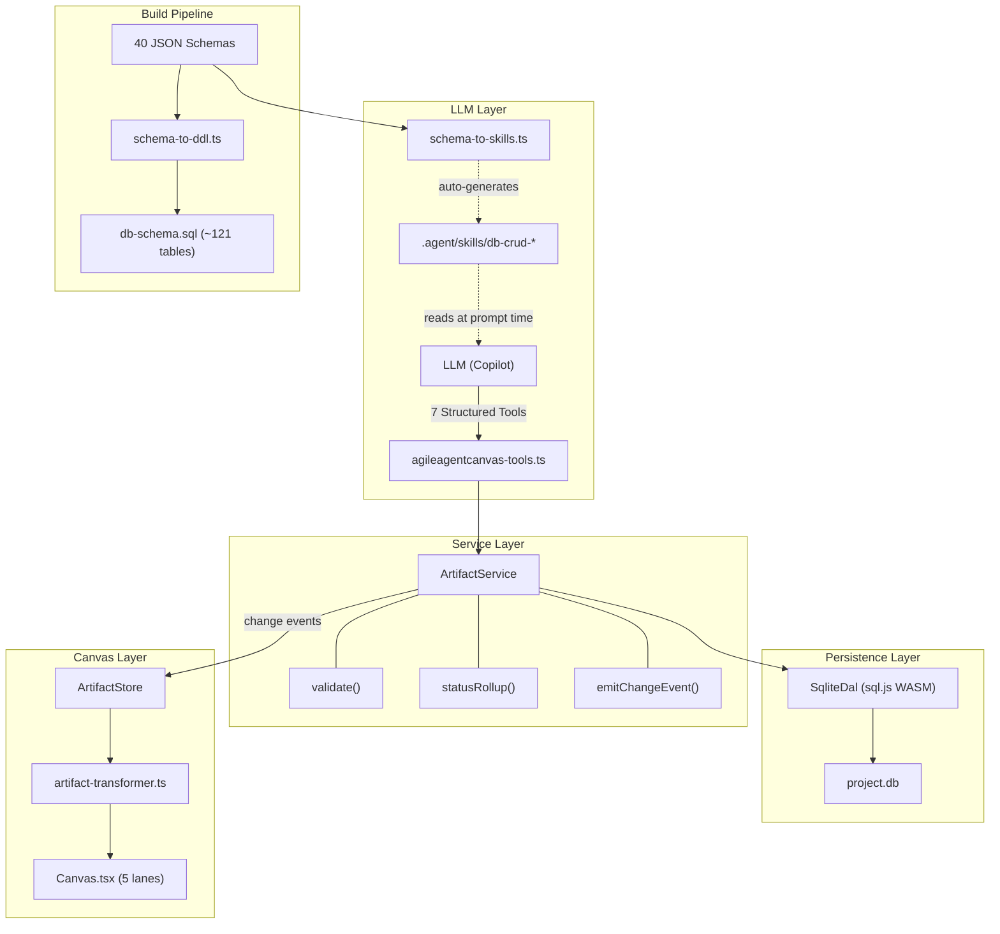

# Revised DB Migration Plan v3

> **Status:** ✅ Approved
> **Supersedes:** `implementation-plan.md` (v2)
> **What changed:** Drops legacy JSON support, adds LLM skill generation, adds canvas logic + UI changes
> **Decisions confirmed:** 5 lanes (Quality right of Implementation), generic compact cards for low-priority types, SQLite-only (no legacy JSON)

---

## Architecture Overview



---

## Key Decisions (Changes from v2)

| Decision | v2 | v3 | Rationale |
|---|---|---|---|
| Legacy JSON support | Feature flag (`json` \| `sqlite`) | **SQLite-only** — no JsonFileDal | User doesn't need backward compat |
| LLM instructions | None — "LLM just figures it out" | **Auto-generated skill files** | LLMs need explicit CRUD guidance |
| Canvas lanes | 4 hardcoded (discovery/planning/solutioning/implementation) | **5 dynamic lanes** (+quality) | 24 types invisible, need homes |
| Status rollup | Static status field | **Computed from children** | Canvas must reflect real progress |
| Skill freshness | N/A | **Regenerated on schema change** | Skills must stay in sync with DDL |

---

## Part 1: Database (Unchanged from v2)

The relational schema in `schema-to-db-mapping.md` is **correct and complete**:
- ~121 tables covering all 40 BMAD schemas
- Typed columns, CHECK constraints, FK cascades
- Shared tables: `requirements`, `acceptance_criteria`, `findings`, `recommendations`, `action_items`
- sql.js WASM engine (Electron-safe)

**Removed from v2:**
- ~~`JsonFileDal`~~ — no longer needed
- ~~Feature flag (`json` | `sqlite`)~~ — always SQLite
- ~~`json-to-sqlite.ts` import script~~ — not needed
- ~~`exportToJson()`~~ — not needed

---

## Part 2: LLM Skill Generation (NEW)

### Problem
The LLM has no instructions on how to interact with the DB. Without explicit guidance, it will:
- Guess field names and get them wrong
- Not know which CHECK constraint values are valid
- Not understand parent→child relationships
- Write to wrong tables or use wrong tool parameters

### Solution: `schema-to-skills.ts`

A build-time generator that reads JSON schemas + generated DDL and produces skill files:

#### Generated Output Files

| File | Content | Regenerated On |
|---|---|---|
| `.agent/skills/db-crud/SKILL.md` | Master CRUD instruction file | Any schema change |
| `.agent/skills/db-crud/schema-reference.md` | All tables, columns, types, constraints | DDL change |
| `.agent/skills/db-crud/enum-registry.md` | All valid enum values per field | Schema change |
| `.agent/skills/db-crud/relationship-map.md` | Parent→child FK relationships | DDL change |
| `.agent/skills/db-crud/examples/` | Per-type CRUD examples (create epic, update story status, query blocked stories) | Schema change |

#### SKILL.md Structure

```markdown
---
name: db-crud
description: CRUD operations for all BMAD artifact types via structured tools
---

## Available Tools

| Tool | Purpose | Example |
|---|---|---|
| `write_artifact` | Create or update any artifact | `write_artifact('story', 'S-1.1', {...})` |
| `read_artifact` | Read specific fields from an artifact | `read_artifact('story', 'S-1.1', ['title', 'status'])` |
| `query_artifacts` | Filter artifacts by type + conditions | `query_artifacts('story', {status: 'blocked'})` |
| `update_fields` | Partial update (single field) | `update_fields('story', 'S-1.1', {status: 'in-progress'})` |
| `list_children` | List child records | `list_children('epic', 'EPIC-1', 'story')` |

## Rules
1. Always use `update_fields` for single-field changes (not `write_artifact`)
2. Status values MUST be from the enum registry — see enum-registry.md
3. Stories are standalone — never embed in epic data
4. Tasks are children of stories — use `write_artifact('task', ...)` with `story_id` FK

## Per-Type Quick Reference
(auto-generated table: type → required fields → valid statuses → parent FK)
```

#### Regeneration Pipeline

```
npm run generate-db
  ├── schema-to-ddl.ts → db-schema.sql (DDL)
  └── schema-to-skills.ts → .agent/skills/db-crud/* (LLM instructions)
```

Both run from the same JSON schemas. One command, both outputs stay in sync.

---

## Part 3: Canvas Logic Changes

### 3A. ArtifactStore — New Data Source

Currently `artifact-store.ts` (6700+ lines) loads from JSON files via `loadFromFolder()`. This must change to load from SQLite via `ArtifactService`:

| Current | New |
|---|---|
| `loadFromFolder(path)` → reads JSON files | `loadFromDb(projectId)` → queries `SqliteDal` |
| File watcher triggers reload | DB change events trigger selective refreshes |
| `updateArtifact()` — 40+ case switch | `ArtifactService.writeArtifact()` — typed dispatch |

#### Status Rollup Logic (in ArtifactService)

```typescript
// When reading an epic, compute status from children:
async function getEpicWithRollup(epicId: string): Promise<Epic> {
    const epic = await this.dal.readArtifact('epic', epicId);
    const stories = await this.dal.listArtifacts('story', { epic_id: epicId });
    
    const total = stories.length;
    const done = stories.filter(s => s.status === 'done').length;
    const inProgress = stories.filter(s => s.status === 'in-progress').length;
    
    epic.computedStatus = total === done ? 'done' 
                        : inProgress > 0 ? 'in-progress' 
                        : epic.status;
    epic.progress = { total, done, inProgress };
    return epic;
}
```

### 3B. Artifact Transformer — Support All 42 Types

Currently `buildArtifacts()` only creates canvas cards for 16 types. The other 26 are loaded but never rendered.

**Change:** Every type in `TYPE_LABELS` gets a canvas card. The transformer must map all types to a lane + position:

| Type | Target Lane | Card Style |
|---|---|---|
| `test-design`, `test-design-qa`, `test-design-architecture` | Quality | Standard card |
| `test-review`, `traceability-matrix` | Quality | Standard card |
| `test-summary`, `test-framework`, `ci-pipeline` | Quality | Compact card |
| `nfr-assessment`, `atdd-checklist`, `automation-summary` | Quality | Compact card |
| `research`, `ux-design` | Discovery | Standard card |
| `readiness-report` | Planning | Standard card |
| `sprint-status`, `retrospective` | Planning | Standard card |
| `change-proposal`, `code-review` | Implementation | Standard card |
| `risks`, `definition-of-done` | Planning | Standard card |
| `fit-criteria`, `success-metrics` | Planning | Compact card |
| `project-overview`, `project-context`, `source-tree` | Discovery | Compact card |
| `tech-spec` | Solutioning | Standard card |
| `storytelling`, `problem-solving`, `innovation-strategy`, `design-thinking` | Discovery | Compact card |

---

## Part 4: Canvas UI Changes

### 4A. 5-Lane Layout

Current 4 lanes → 5 lanes (add **Quality**):

```
┌──────────┬───────────────┬───────────────┬───────────────┬───────────────┐
│ Discovery│   Planning    │  Solutioning  │Implementation │   Quality     │
├──────────┼───────────────┼───────────────┼───────────────┼───────────────┤
│ Brief    │ PRD           │ Architecture  │ Epics         │ Test Designs  │
│ Vision   │ Requirements  │ ADRs          │  └─ Stories   │ Test Reviews  │
│ Research │  └─ Func      │ Components    │     └─ Tasks  │ Traceability  │
│ UX Design│  └─ NFR       │ Tech Specs    │  └─ Use Cases │ Test Summary  │
│ Proj Ctx │  └─ Addtl     │               │ Test Strategy │ CI Pipeline   │
│ Proj Ovw │ Risks/DoD     │               │ Code Reviews  │ Test Framework│
│ Source   │ Sprint Status │               │ Change Props  │ ATDD/NFR/Auto │
│ CIS types│ Readiness     │               │               │               │
│          │ Fit/Metrics   │               │               │               │
└──────────┴───────────────┴───────────────┴───────────────┴───────────────┘
```

#### Code Changes in Canvas.tsx

```typescript
// CURRENT (line 59-64):
const LANE_DEFS = [
  { key: 'discovery',      left: 30,   width: 320,  cardTypes: [...] },
  { key: 'planning',       left: 370,  width: 1050, cardTypes: [...] },
  { key: 'solutioning',    left: 1440, width: 1050, cardTypes: [...] },
  { key: 'implementation', left: 2510, width: 400,  cardTypes: [...] },
];

// NEW:
const LANE_DEFS = [
  { key: 'discovery',      left: 30,   width: 400,  cardTypes: [
    'product-brief', 'vision', 'research', 'ux-design',
    'project-overview', 'project-context', 'source-tree',
    'storytelling', 'problem-solving', 'innovation-strategy', 'design-thinking'
  ]},
  { key: 'planning',       left: 450,  width: 1050, cardTypes: [
    'prd', 'requirement', 'nfr', 'additional-req', 'risk', 'risks',
    'definition-of-done', 'fit-criteria', 'success-metrics',
    'readiness-report', 'sprint-status', 'retrospective'
  ]},
  { key: 'solutioning',    left: 1520, width: 800,  cardTypes: [
    'architecture', 'architecture-decision', 'system-component', 'tech-spec'
  ]},
  { key: 'implementation', left: 2340, width: 500,  cardTypes: [
    'epic', 'story', 'task', 'use-case', 'test-strategy',
    'change-proposal', 'code-review'
  ]},
  { key: 'quality',        left: 2860, width: 500,  cardTypes: [
    'test-design', 'test-design-qa', 'test-design-architecture',
    'test-cases', 'test-case', 'test-coverage',
    'test-review', 'traceability-matrix', 'test-summary',
    'test-framework', 'ci-pipeline', 'nfr-assessment',
    'atdd-checklist', 'automation-summary'
  ]},
];
```

Also update: `LANE_TYPES`, `FILTER_TYPE_GROUPS`, `FILTER_TYPE_LABELS` (line 49-139).

### 4B. Status Rollup Visualization

Epics and test-designs already have progress bars (from recent work). Extend to:

| Parent Type | Rolls Up From | Display |
|---|---|---|
| Epic | story statuses | Progress bar (existing) |
| Test Design | test-case execution statuses | Progress bar (existing) |
| PRD | requirement statuses (proposed→verified) | **NEW** progress bar |
| Architecture | ADR statuses (proposed→accepted) | **NEW** progress bar |
| Sprint Status | story statuses across all epics | **NEW** overall progress |

### 4C. New Card Renderers

Need renderers for types that currently have no card UI:

| New Renderer Needed | Module | Complexity |
|---|---|---|
| `research` | CIS/BMM | Medium — title, type, key findings |
| `ux-design` | BMM | Medium — design philosophy, pages |
| `sprint-status` | BMM | High — multi-epic summary table |
| `retrospective` | BMM | Medium — went well/didn't, metrics |
| `readiness-report` | BMM | High — multi-section assessment |
| `change-proposal` | BMM | Medium — impact, recommendation |
| `code-review` | BMM | Medium — verdict, finding counts |
| `test-review` | TEA | Medium — rating, coverage |
| `traceability-matrix` | TEA | Medium — coverage %, gaps |
| `ci-pipeline` | TEA | Low — stages list |
| `tech-spec` | BMM | High — overview, phases |
| `project-overview` | BMM | Medium — classification, stats |
| `definition-of-done` | BMM | Low — checklist items |
| CIS types (4) | CIS | Low — narrative summary |

> Lower-priority types (`test-framework`, `automation-summary`, `atdd-checklist`, `nfr-assessment`, `fit-criteria`, `success-metrics`, `project-context`, `source-tree`) can start with a **generic compact card** showing just title + status + description.

### 4D. Detail Panel Renderers

Each new card type also needs a `DetailPanel` renderer for the slide-out detail view. These map DB columns to UI sections:

```typescript
// Example: research detail renderer
case 'research':
  return <ResearchDetail artifact={artifact} />;
  // Shows: type, topic, scope, methodology, findings, synthesis
```

---

## Implementation Phases (Revised)

### Phase 1: Foundation (3 files)
| File | Purpose |
|---|---|
| `src/state/artifact-dal.ts` | Typed DAL interface |
| `src/state/artifact-service.ts` | Business logic + status rollup |
| `src/state/schema-to-ddl.ts` | DDL generator |

### Phase 2: SQLite DAL (3 files)
| File | Purpose |
|---|---|
| `src/state/sqlite-dal.ts` | sql.js implementation |
| `src/state/db-schema.sql` | Generated DDL |
| `src/state/migrations/001_initial.sql` | Initial migration |

### Phase 3: LLM Skill Generation (2 files, auto-generates ~6)
| File | Purpose |
|---|---|
| `src/build/schema-to-skills.ts` | Skill file generator |
| `package.json` | `"generate-db"` script runs DDL + skills |
| **Generated →** `.agent/skills/db-crud/*` | LLM instruction files |

### Phase 4: LLM Tools (1 modified file)
| File | Change |
|---|---|
| `src/chat/agileagentcanvas-tools.ts` | 7 structured tools routed through ArtifactService |

### Phase 5: Canvas Logic (2 modified files)
| File | Change |
|---|---|
| `src/state/artifact-store.ts` | Replace `loadFromFolder` → `loadFromDb`, remove JSON parsing |
| `src/canvas/artifact-transformer.ts` | Map all 42 types to 5 lanes with positions |

### Phase 6: Canvas UI (6+ modified files)
| File | Change |
|---|---|
| `webview-ui/src/components/Canvas.tsx` | 5-lane layout, updated LANE_DEFS/FILTER_TYPE_GROUPS |
| `webview-ui/src/components/ArtifactCard.tsx` | Support new card types |
| `webview-ui/src/components/DetailPanel.tsx` | New detail renderers |
| `webview-ui/src/components/renderers/bmm-renderers.tsx` | New BMM type renderers |
| `webview-ui/src/components/renderers/tea-renderers.tsx` | New TEA type renderers |
| `webview-ui/src/components/renderers/cis-renderers.tsx` | New CIS type renderers |
| `webview-ui/src/index.css` | New card styles, quality lane color |

### Phase 7: Package & Verify
| Task | Detail |
|---|---|
| `package.json` | Add `sql.js`, remove JSON file deps |
| DDL coverage test | Schema fields vs table columns = 100% |
| DAL round-trip test | Write → read → assert for all 42 types |
| Canvas render test | All 42 types render as cards |
| Skill freshness test | Change schema → regenerate → verify skills updated |

---

## File Impact Summary

| Category | New Files | Modified Files |
|---|---|---|
| Database | 5 (`artifact-dal.ts`, `artifact-service.ts`, `schema-to-ddl.ts`, `sqlite-dal.ts`, `db-schema.sql`) | 0 |
| LLM Skills | 1 generator + ~6 auto-generated | 1 (`agileagentcanvas-tools.ts`) |
| Canvas Logic | 0 | 2 (`artifact-store.ts`, `artifact-transformer.ts`) |
| Canvas UI | 0 | 6+ (Canvas, ArtifactCard, DetailPanel, renderers, CSS) |
| Build | 0 | 1 (`package.json`) |
| **Removed** | — | `json-file-dal.ts`, `json-to-sqlite.ts`, feature flag code |
| **Total** | **~12 new** | **~10 modified** |
